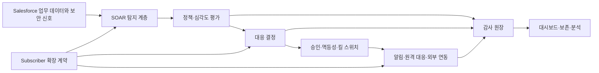

# 아키텍처와 설계 판단

## 전체 흐름

## 주요 계층

| 계층 | 책임 | 설계 의도 |
|---|---|---|
| 탐지 | 업무 객체·플랫폼·외부 신호 수집 | 신호 생성과 대응 실행 분리 |
| 정책 | 코드·심각도·임계치·액션 평가 | 조직별 운영값과 기본값을 구분 |
| 대응 | 표준 액션, 승인, 롤백, 킬 스위치 | 파괴적 조치의 안전 경계 확보 |
| 전달 | Teams·Slack·이메일·외부 관제 | Named Credential, 중복 억제, 재시도 |
| 감사 | 탐지·평가·승인·실행·실패 기록 | 운영자가 원인을 재구성 가능 |
| 표현 | 대시보드·Zero-Login 결과 화면 | 운영 정보와 민감 정보 분리 |

## 설계 판단

### 1. 탐지와 대응을 분리

센서나 업무 로직은 “의심스러운 일이 발생했다”는 신호를 생성합니다. 실제 사용자 동결이나 세션 종료 같은 조치는 정책, 승인, 중복 방지와 감사 흐름을 거친 뒤 실행합니다. 이 분리 덕분에 고객은 같은 탐지 신호를 조직별 대응 정책에 맞춰 조정할 수 있습니다.

### 2. 설치와 활성화를 분리

관리 패키지 설치는 공통 기능을 전달하지만, 외부 채널·Sites·스케줄·운영 정책은 고객 조직의 보안 의사결정이 필요합니다. Setup & Health Center는 이 차이를 상태 카드와 1-Click 설정으로 드러냅니다.

### 3. 외부 연결은 Named Credential 경계 사용

외부 URL과 인증값을 비즈니스 로직이나 사용자 입력 필드에 섞지 않고 Salesforce의 인증 저장소와 패키지 라우팅 계층으로 분리했습니다. 연결 상태와 실패 재시도를 운영자가 확인할 수 있도록 전달 원장을 둡니다.

### 4. Subscriber 확장 계약 제공

고객 조직마다 센서와 후속 업무가 다르므로 내부 구현을 복제하게 하지 않고, 센서·표준 이벤트·Flow·렌더링 같은 제한된 계약을 제공합니다. 계약은 목적과 보안 경계를 설명하고, 내부 클래스·데이터 구조는 숨깁니다.

### 5. 운영 실패를 정상 상태로 취급

전송 실패, 중복 이벤트, 정책 Drift, 승인 대기, 만료 토큰은 예외적인 개발 오류가 아니라 운영에서 발생하는 상태입니다. 원장·상태·재시도·복구 UI로 운영자가 다음 조치를 판단할 수 있게 했습니다.

