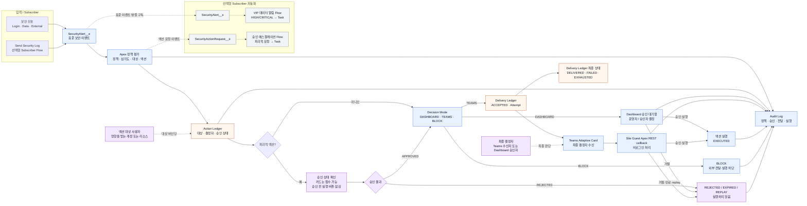

# 패키지 흐름과 사용자 페르소나

이 문서는 SOAR 패키지를 설치·운영할 때 각 구성요소가 어디에서 실행되고, 누가 어떤 결정을 내리는지 설명합니다. 설치 방법은 [설치 후 전체 사용 런북](./end-to-end-runbook.md)을 기준으로 하고, 이 문서는 구조와 책임 경계를 이해하는 데 사용합니다.

## 1. 아키텍처 기반 전체 흐름

### 흐름을 읽는 핵심

1. 보안 신호는 `SecurityAlert__e`로 표준화되고, 실제 정책 판단은 패키지 Apex가 담당합니다.
2. `Action Ledger`는 어떤 액션을 누구에게 적용할지와 승인 상태를 기록합니다.
3. `Decision Mode`가 `DASHBOARD`이면 Dashboard가 결정 화면이고, `TEAMS`이면 Teams 수신자가 최종 결정 화면입니다.
4. `BLOCK`은 외부 카드와 액션 실행을 열지 않고 감사 기록만 남기는 정상 경로입니다.
5. `Delivery Ledger`는 Teams 같은 외부 채널로 전달된 결과를 기록하며, `Action Ledger`를 대신하지 않습니다.
6. Teams callback은 Site 홈이 아니라 Site의 Apex REST 경로를 호출합니다.
7. 패키지 Flow 템플릿은 Task·티켓 같은 보조 업무를 만들 수 있지만 정책 Route·결정자·두 Ledger를 소유하지 않습니다.

## 2. 사용자 페르소나

| 페르소나 | 주요 책임 | 기억할 경계 |
|---|---|---|
| 설치 관리자 | 패키지 설치, 권한, Site/Guest, Named Credential, 정책 초기화 | 액션 대상과 분리. 관리자에게 대상을 직접 지정하지 않음 |
| 보안 운영자 | Dashboard, Audit Log, Threat Simulator, Policy Builder 조회·검토 | 시뮬레이터 성공만으로 Teams E2E를 판정하지 않음 |
| 최종 결정자 | Dashboard 또는 Teams에서 승인·거절·실행 결정 | `TEAMS` Route의 카드 수신자이며 액션 대상과 다름 |
| 액션 대상 사용자/리소스 | 정책 이벤트의 영향 대상 | 운영 권한이나 승인 권한을 자동으로 받지 않음 |
| Subscriber 자동화 담당자 | Flow·Apex·티켓·Incident 후속 자동화 | 공개 이벤트·계약만 사용하고 패키지 원장을 직접 수정하지 않음 |
| Site Guest 실행 컨텍스트 | 로그인 없는 callback 처리 | 최소 권한·단기 code·단회 사용 경계 |

### 설치 관리자

`SOAR_Admin`은 초기 설정과 복구에 필요한 사용자에게만 할당합니다. Setup & Health Center, Site/Guest, Inbound Base URL, Named Credential, Principal Access, 정책·Route·스케줄·Flow 활성화 여부를 확인하는 역할입니다.

설치 관리자는 반드시 액션 대상 사용자와 분리합니다. 관리자라는 이유만으로 Teams 카드의 최종 결정자가 될 필요는 없습니다.

### 보안 운영자

`SOAR_Operator`는 Dashboard와 감사 로그를 확인하고 시뮬레이션·정책 검토를 수행합니다. 운영자는 이벤트의 대상과 결정자를 구분하고, Action Ledger와 Delivery Ledger를 별도로 확인합니다.

### 최종 결정자

`DASHBOARD` Route에서는 Dashboard 승인 대기열이 결정 화면이고, `TEAMS` Route에서는 Teams 카드 수신자가 최종 결정 화면입니다. 파괴적 액션은 독립 승인 전 실행 버튼이 잠기며, 거절 사유와 실행 결과가 감사 원장에 남아야 합니다.

### 액션 대상

정책에 걸린 사용자·레코드·IP 같은 영향 대상입니다. 대상 사용자는 액션을 결정하는 사람도, 운영 권한을 가진 사람도 아닙니다. 테스트에서는 관리자 계정이 아닌 별도 테스트 사용자를 지정합니다.

## 3. 누가 무엇을 결정하는가

| 질문 | 담당 |
|---|---|
| 어떤 신호를 보안 이벤트로 만들 것인가? | Subscriber 센서·Flow 담당자 |
| 어떤 정책과 액션을 선택할 것인가? | 패키지 Apex 정책 평가 |
| 액션 대상은 누구인가? | 이벤트 문맥과 정책 대상 바인딩 |
| 어떤 화면으로 보낼 것인가? | Route의 `DASHBOARD/TEAMS/BLOCK` 설정 |
| 파괴적 액션을 열어도 되는가? | 독립 승인과 Action Ledger 상태 |
| 외부 전송이 성공했는가? | Delivery Ledger와 외부 채널 수신 증적 |
| 결과와 실패를 어디에 남기는가? | Audit Log, Action Ledger, Delivery Ledger |

## 4. 성공 판정 기준

### 연결성만 확인한 경우

Named Credential Health/Webhook/Ping 성공과 HTTP 202는 외부 endpoint 연결·수락 증적입니다. 정책 평가, Ledger 생성, Teams 카드 수신까지 확인한 것은 아닙니다.

### 정책 기반 Teams 전달을 완료로 판정하는 경우

1. 실제 정책 이벤트 또는 `Send Security Log` 입력 생성
2. 정책 평가와 대상 바인딩 실행
3. Action Ledger의 결정·승인 상태 기록
4. `NOTIFY_TEAMS` Route 선택
5. Delivery Ledger에 `ACCEPTED`와 Attempt 생성
6. Teams 카드가 최종 결정자에게 도착
7. 최종 상태 `DELIVERED` 확인
8. callback 결과와 Audit Log 일치 확인

Threat Simulator로 감사 로그만 증가한 경우에는 위 경로의 일부만 확인된 것으로 기록합니다.

## 5. 사용자가 기억할 경계

- Subscriber 조직에는 Provider 소스를 직접 배포하지 않고 관리 패키지를 설치합니다.
- Flow가 `Draft/비활성`이어도 핵심 Apex 정책·Ledger·callback 경로가 자동으로 고장 난 것은 아닙니다.
- `ACCEPTED`는 외부 전송 접수이고, `DELIVERED`가 최종 전달 성공입니다.
- Action Ledger는 의사결정 원장이고, Delivery Ledger는 외부 전달 원장입니다.
- Site callback URL이 Apex REST 경로로 보이는 것은 정상입니다.
- Slack은 현재 검증본에서 실제 Block Kit callback 전달이 완료된 채널이 아닙니다.
- 파괴적 액션은 테스트에서 실제 대상에 실행하지 않고 승인·버튼·callback·감사 계약만 검증합니다.
